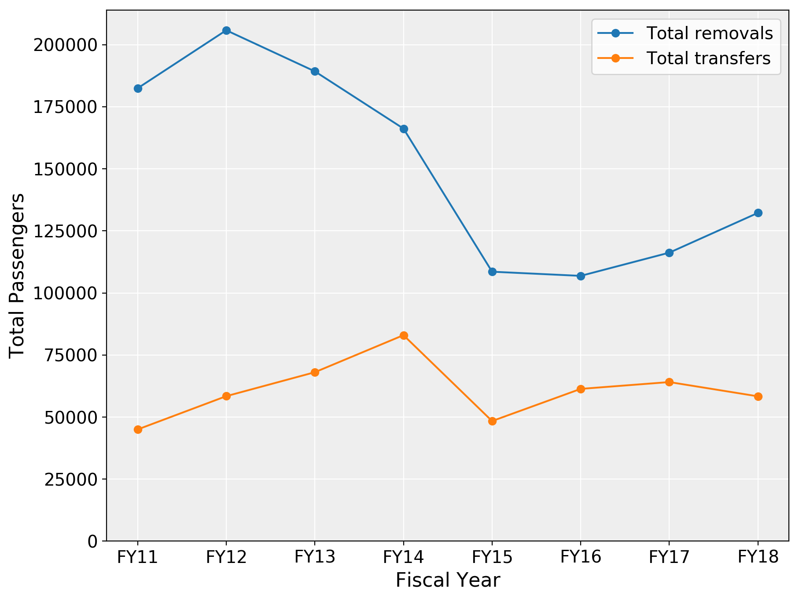

# ICE Air Operations

## The ARTS Dataset

This report uses data from ICE's Alien Repatriation Tracking System (ARTS) obtained via a Freedom of Information Act (FOIA) Request by the University of Washington Center for Human Rights. The ARTS dataset contains 1731580 records relating to ICE Air Operations charter flights during the period from October 1, 2010 to December 5, 2018, including full data for U.S. Federal Government Fiscal Years 2011 through 2018.<a href="#_ftn1" name="_ftnref1"><sup>[1]</sup></a>

The ARTS dataset is made up of 43 fields, defined in a data dictionary provided by ICE; however, as described below, the content of these fields does not always conform to the definitions provided. The first 25 fields relate to passenger and mission characteristics; the latter 18 fields, marked by various prefixes, relate to characteristics of the airports and locations associated with each record. (Additional fields generated by UWCHR in the process of analysis of the dataset are not enumerated here.) There is no indication that the content of any of these fields was withheld or redacted by ICE upon release of the dataset.

The ARTS dataset uses three key fields to identify passengers (`AlienMasterID`) and missions (`MissionID` and `MissionNumber`). The `AlienMasterID` field is made up of 1731580 unique values. `AlienMasterID` values are consecutive numbers starting at 5000 and incrementing to 2047246.

Each `AlienMasterID` value is used a maximum of 1 times. This means that there is no inherent way to track the movement of individual passengers on multiple flights in the ARTS dataset as released to the UWCHR by ICE; close analysis of specific combinations of passenger characteristics (i.e. age, nationality, criminal conviction status) does suggest that passengers are represented multiple times in the dataset, but systematically identifying individual passengers would be prohibitively difficult.

According to a [2015 audit of ICE Air by the Department of Homeland Security Office of Inspector General (OIG)](https://www.oig.dhs.gov/sites/default/files/assets/Mgmt/2015/OIG_15-57_Apr15.pdf), the ARTS database does include fields for passenger A-Numbers and Fingerprint IDs, which would permit tracking of repeat passengers; though the OIG also notes inconsistencies in the usage of these identifiers. The OIG report confirms that some passengers are subjected to repeated transfers, noting several cases of apparently redundant transfers.

The `MissionID` and `MissionNumber` also present limitations for detailed analysis. The dataset contains 14961 `MissionID` and 14961 `MissionNumber` values, which appear to be completely equivalent: combinations of these values are strictly one-to-one, and they are not hierarchical (see code snippet below). Like `AlienMasterID`, both values consist of consecutive numbers, which suggests that contrary to the ARTS data dictionary, the `MissionNumber` field bears no relation to actual flight numbers.


```python

assert sum(df.groupby(['MissionID', 'MissionNumber'])['MissionNumber'].nunique() > 1) == 0
assert sum(df.groupby(['MissionNumber', 'MissionID'])['MissionID'].nunique() > 1) == 0
assert sum(df.groupby(['MissionNumber', 'MissionID'])['MissionDate'].nunique() > 1) == 0
assert sum(df.groupby(['MissionID', 'MissionNumber'])['MissionDate'].nunique() > 1) == 0
```


ICE Air missions as represented by the `MissionID` and `MissionNumber` fields never span more than one day, though multiple missions may occur on a given date. The `MissionDate` field is only accurate to the day; the dataset does not include any other time data, such as takeoff or landing timestamps.

Each mission can include multiple combinations of pickup and drop-off locations, represented by the `PULOC` and `DropLoc` fields. These values encode the pickup and drop-off location for each passenger on the mission, not the flight itinerary of the mission. Therefore, while each mission may include multiple flights, it is not possible to use this version of the ARTS database to conclusively calculate the total number of flights operated by ICE Air.

Remaining fields in the dataset represent passenger and airport characteristics. Many of the fields are unstandardized and present significant challenges for cleaning and analysis, especially the `Status`, `GangMember`, and `Convictions` fields, which include many unique and often irrelevant values. (This concern was also noted by the DHS OIG in its 2015 audit.) Several of these fields are worth explaining here:

* The `Status` field, despite being defined in the ARTS Data Dictionary as relating to "Criminal Status", appears to relate to the passenger's grounds for deportability or the status of their immigration case. Some values in this field conform to a set of 29 alphanumeric codes used by ICE categorize the status of removal processes (see Kerwin et al., 2015, for a description of each of these codes *include table in report*), others consist of unstandardized text descriptions, including unrelated or irrelevant values. In total this field contains more than 937 unique values.
* The `Convictions`, `Criminality` and `Code` fields all represent different ways of coding a passenger's criminal status. `Convictions` is an unstructured field with 14709 unique values, presumably representing each passenger's most serious criminal conviction. The `Criminality` field is more structured and was easily cleaned into a binary category where "NC" represents passengers without a criminal conviction and "C" represents passengers with a criminal conviction. However, it is important to note that this field is not always consistent with the `Convictions` field, and it contains 21163 missing values, especially in the earlier period of the dataset. The `Code` field consists of a relatively structured set of alphabetic codes which also appear to relate to criminal status, but their meaning is unclear.
* The `Age` and `Juvenile` fields are relatively self-explanatory. `Juvenile` is a binary field where all passengers aged 17 or younger are marked True; the values in this field are consistent with the numeric values in `Age`. Values below 0 or above 99 in `Age` were set as null values in the cleaning process.
* Notably, two ARTS fields that would likely be of great interest to researchers and advocates, `FamilyUnitFlag` and `UnaccompaniedFlag` (presumably relating to unaccompanied minors), are entirely unused in this dataset: not a single record is flagged with either of these values. As noted above, there is no indication that these values have been redacted or withheld by ICE, suggesting that they are simply not used.

## Cleaning

In fact, upon close inspection of the records with repeated `AlienMasterID` values, it becomes apparent that these records are only repeated because of inconsistencies in certain airport and location values, which results in the duplication of some passenger records.

## Analysis


The ARTS dataset contains 1.73 million records of passengers on nearly 15,000 ICE Air Operations missions during the period from October 1, 2010 to December 5, 2018, including full data for U.S. Federal Government Fiscal Years 2011 through 2018.

The ARTS database assigns each passenger a unique ID for each mission. Because this ID is simply a sequential numeric ID, and the dataset does not include other unique identifiers such as passenger name or A-number, it is not inherently possible to determine the number of individuals represented in the dataset; nor is it possible to track individuals who may have experienced multiple flights. Close inspection of the data does permit identification of possible repeat passengers based on combinations of characteristics, such as age, country of citizenship, etc. However, given the number of records contained in the dataset, and notable inconsistencies in data entry, such a de-duplication process at scale would be prohibitive, if feasible.

ICE Air "missions" are identified by a unique ID value. Each mission can include multiple combinations of pickup and drop-off locations. These values encode the pickup and drop-off location for each passenger on the mission, not the flight itinerary of the mission. Therefore, while each mission may include multiple flight segments, the ARTS database does not represent the total number of flights operated by ICE Air during the period covered.

Missions can include a mix of passengers destined for either "removal" from the U.S. to another country or to hubs near the U.S.-Mexico border, where deportation proceeds via ground transportation; or "transfer" between locations within the U.S. (A small number of records denote "transfers" and "removals" originating outside of the U.S., and "transfers" destined to non-U.S. countries; it is possible that these represent errors in data entry.)


71.2% of passengers in the ARTS database were destined for removal, 28.8% represent transfers. Due to the limitations of the ARTS database described above, it is difficult to determine how many passengers categorized as transfers may simply be in the staging process for deportation, versus transfer for other reasons such as between detention facilities, appearances in legal processes, or release. (A trivial number of passengers are not categorized as either removals or transfers.)

FY 2012 had the highest passenger volume in the dataset, with 264230 total passengers. After declining to a minimum of 156946 total passengers during FY 2015, the number of passengers begins to ascend again, reaching 190601 total passengers during FY 2018:

<div align='center'>
<p><strong>Figure 1: ICE Air Annual Passengers</strong></p>

{#trend_plot }\

</div>

Passengers 

As revealed by the ARTS data, ICE Air is global in scale. In total, over the period covered by the ARTS dataset, ICE Air operations have been conducted to or from 88 airports in the U.S. and its territories; and to 135 airports in 118 other countries worldwide.

ICE Air's reach has expanded with time. During Fiscal Year 2018, the last year for which complete data is available, ICE Air operations were carried out in 69 countries, including the United States; passengers were picked up at 40 different airports and dropped off at 107 airports. As seen in the chart below, the reach of ICE Air has grown steadily since falling off during FY 2013; with operations in FY 2018 representing its maximum extent in terms of unique dropoff airports and destination countries (including the U.S.).

<div align='center'>
<p><strong>Table 1: ICE Air's Global Reach</strong></p>
<table>
<thead>
<tr><th style="text-align: right;">    </th><th style="text-align: right;">  Pickup Airports</th><th style="text-align: right;">  Dropoff Airports</th><th style="text-align: right;">  Destination Countries</th></tr>
</thead>
<tbody>
<tr><td style="text-align: right;">2011</td><td style="text-align: right;">               41</td><td style="text-align: right;">                69</td><td style="text-align: right;">                     35</td></tr>
<tr><td style="text-align: right;">2012</td><td style="text-align: right;">               44</td><td style="text-align: right;">                78</td><td style="text-align: right;">                     42</td></tr>
<tr><td style="text-align: right;">2013</td><td style="text-align: right;">               45</td><td style="text-align: right;">                48</td><td style="text-align: right;">                     16</td></tr>
<tr><td style="text-align: right;">2014</td><td style="text-align: right;">               41</td><td style="text-align: right;">                62</td><td style="text-align: right;">                     20</td></tr>
<tr><td style="text-align: right;">2015</td><td style="text-align: right;">               36</td><td style="text-align: right;">                60</td><td style="text-align: right;">                     32</td></tr>
<tr><td style="text-align: right;">2016</td><td style="text-align: right;">               39</td><td style="text-align: right;">                86</td><td style="text-align: right;">                     53</td></tr>
<tr><td style="text-align: right;">2017</td><td style="text-align: right;">               40</td><td style="text-align: right;">                85</td><td style="text-align: right;">                     49</td></tr>
<tr><td style="text-align: right;">2018</td><td style="text-align: right;">               40</td><td style="text-align: right;">               107</td><td style="text-align: right;">                     69</td></tr>
</tbody>
</table>
</div>

## Notes

<a href="#_ftnref1" name="_ftn1"><sup>[1]</sup></a> Test note
